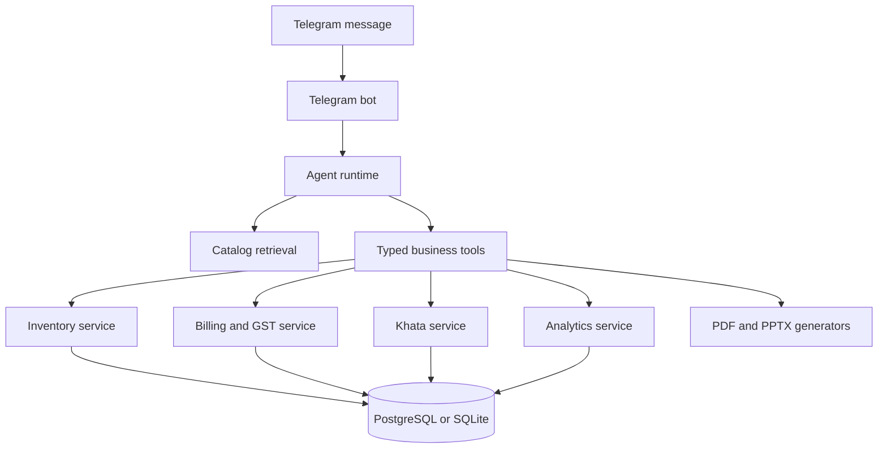

# Tele Agent

**A production-minded Telegram operations assistant for Indian kirana and supermarket businesses.**

Tele Agent lets store owners manage inventory, create GST-ready bills, maintain customer khata accounts, inspect sales, and generate business documents using natural language in Telegram.

The language model coordinates the conversation. Business-critical decisions remain in deterministic Python services and the database, so prices, stock, tax calculations, balances, and billing rules are not invented by the model.

## What It Does

- **Natural-language store operations** through Telegram
- **Product and inventory management** with stock receiving, search, low-stock detection, and reorder levels
- **Database-backed retrieval** for product, price, GST, HSN, availability, and inventory questions
- **Multi-turn billing** with add, update, remove, preview, and explicit finalization
- **GST-aware invoicing** with CGST and SGST calculation for intra-state sales
- **Khata management** for customer credit, payments, and balances
- **Sales analytics** including revenue, GST, payment mix, and top-selling items
- **PDF GST invoices** and **editable PowerPoint analysis decks**
- **Persistent owner preferences** such as default payment mode and shop details
- **Idempotent Telegram updates** and guarded stock mutations

## Example Conversations

```text
50 packets of Maggi came in, cost INR 12, MRP INR 14

How much sugar is left?

Make a bill: 2 kg sugar, 1 Aashirvaad Atta 5 kg, 4 Maggi, UPI

Remove the butter and make it 6 Maggi

Preview the bill

Finalize the bill

Put INR 500 on Ramesh's credit

Ramesh paid INR 300

What is Ramesh's balance?

Send me the last invoice as a PDF

Make this week's sales analysis deck
```

## How It Works



### Design principles

- The database is the source of truth for products, prices, stock, GST, bills, and khata balances.
- Product retrieval grounds factual answers in active database records.
- Ambiguous product names require clarification instead of guessing.
- Draft bills do not reduce stock. Stock is reduced only after explicit finalization.
- Finalization rechecks stock inside a transaction and is protected by idempotency keys.
- Production deployments use PostgreSQL because row-level locking is required for safe concurrent stock updates.
- Telegram responses are concise, mobile-friendly, and formatted as readable plain text rather than wide Markdown tables.

## Technology

- Python 3.11+
- Groq tool calling
- Python Telegram Bot
- SQLAlchemy 2
- PostgreSQL for production, SQLite for local development
- Pydantic Settings
- ReportLab for PDF invoices
- python-pptx and Matplotlib for analysis decks
- pytest and Ruff

## Requirements

- Python 3.11 or newer
- A Telegram bot token from [BotFather](https://t.me/BotFather)
- A Groq API key
- PostgreSQL for production deployments

## Local Setup

### 1. Create the environment

```bash
python -m venv .venv
```

Windows PowerShell:

```powershell
.venv\Scripts\Activate.ps1
```

macOS/Linux:

```bash
source .venv/bin/activate
```

### 2. Install dependencies

```bash
python -m pip install --upgrade pip
python -m pip install -e ".[dev]"
```

### 3. Configure environment variables

Copy `env.example` to `.env` and set your credentials:

```env
APP_ENV=development
LOG_LEVEL=INFO
GROQ_API_KEY=your-groq-api-key
GROQ_MODEL=openai/gpt-oss-20b
TELEGRAM_BOT_TOKEN=your-telegram-bot-token
DATABASE_URL=sqlite:///./tele_agent.db
STORE_STATE=Tamil Nadu
AGENT_MAX_TOOL_ROUNDS=8
```

Never commit `.env` or real credentials.

### 4. Create the database and seed demo products

```bash
python -m scripts.seed
```

The seed command creates the database tables and inserts the demo catalog when a SKU does not already exist.

### 5. Start the bot

```bash
python -m app.main
```

The bot uses Telegram long polling and will begin accepting messages after startup validation succeeds.

## Docker

Build the image:

```bash
docker build -t tele-agent .
```

Run it with an environment file:

```bash
docker run --env-file .env tele-agent
```

For production, set `APP_ENV=production` and use a PostgreSQL `DATABASE_URL`. The application intentionally rejects SQLite in production mode.

## Catalog CSV Import

The repository includes a catalog exporter for Supabase or another PostgreSQL-compatible table import:

```bash
python -m scripts.export_catalog
```

The generated CSV contains the `products` table fields, including:

- `id`
- `sku`
- product and pricing fields
- `stock_quantity`
- `reorder_level`
- `active`
- `created_at`
- `updated_at`

If `products_rows.csv` exists, the exporter skips matching SKUs so existing products are not duplicated during import. Review the generated file before uploading it to a live database.

## Commands

| Command | Purpose |
| --- | --- |
| `/start` | Show the bot introduction |
| `/help` | Show supported examples |
| `/new` | Clear conversation context without changing store data |

## Verification

Run the test suite:

```bash
pytest -q
```

Run lint checks:

```bash
ruff check .
```

The tests cover GST rounding, product retrieval and ambiguity handling, stock guards, multi-turn billing, finalization idempotency, khata rules, preferences, and generated documents.


## Project Structure

```text
app/
  agent/       Agent prompt, runtime, and typed tools
  bot/         Telegram handlers and update processing
  db/          SQLAlchemy models, engine, and sessions
  documents/   Invoice PDF and analysis deck generation
  domain/      Inventory, billing, GST, khata, analytics, and preferences
scripts/       Seed and catalog export commands
tests/         Unit and integration-oriented tests
```

## Security Notes

- Do not commit `.env`, API keys, Telegram tokens, database credentials, generated documents, or local database files.
- Use a separate staging database for integration and concurrency testing.
- Review catalog data and GST rates before using the system for real transactions.
- Restrict database credentials to the minimum permissions required by the deployment.
